# 325 国王星球剧情演出重做报告

## 概述

按用户要求，参考 **B612 已定稿的剧情演出模式**（黑场淡入开场、头顶打字机旁白、对白框整章推进、鸟群托举离星、黑场落幕字幕），重做 325 号小行星（原著第十章「小王子发现了一个住着国王的星球」）的剧情演出。对白文本严格取自原著周克希译本第十章，不参考其他草稿星球。

- 剧情脚本：[planet/325.tscn](../planet/325.tscn) 内嵌 `GDScript_story`
- 截图采集脚本：[tests/capture_325_shots.gd](../tests/capture_325_shots.gd)
- 自测脚本：[tests/verify_arc_planet.gd](../tests/verify_arc_planet.gd)

## 剧情演出流程（严格按原著第十章）

### 1. 开场（夜面降落）
黑场淡入后，三句章节旁白交代旅程起点：「为了增长见识，小王子开始逐一拜访附近的小行星」「第一颗星球上，住着一位国王」「他穿着紫红色的白鼬皮长袍，坐在既简单又威严的王座上」。随后解锁移动，玩家出生在国王对面的夜面。

### 2. 出生点偷听（耗子审判）
玩家路过耗子洞附近时，远处传来两句断续的判词：「判你死刑。」「我赦免你。」——原著中老国王自审老耗子的伏笔。

### 3. 先闻其声（地平线后的国王）
玩家走近但仍隔着地平线时，头顶浮现「「……来了一个臣民……」」，随后旁白解释国王的世界观：「他从来没见过我，怎么会认得我呢？」「对于国王来说，世界是非常简单的。」「所有的人都是臣民。」

### 4. 觐见（触发禁区自动对白）
玩家踏入王袍铺地的禁区，输入锁定，整章对白依次推进：

- 「走近些，让我看清楚点。」
- 打哈欠风波：「我禁止你打哈欠。」→「那我命令你打哈欠。」→「来！再打一个，这是命令。」
- 权威与理性：「如果我命令一位将军像蝴蝶一样从一朵花飞到另一朵花…」「权威首先是建立在理性之上的。」
- 统治范围：「陛下，您统治什么？」「统治一切。」「星星服从吗？」「当然，它们立刻服从。」
- 日落请求：「我很想看一次日落...请给我这个恩惠...命令太阳下山...」→ 查历书 →「大约...今晚七点四十分左右！」

### 5. 自由走动 + 二次交互
第一段对白结束，玩家恢复自由移动，交互提示（A）落在国王身上；再次交互进入大臣任命段：

- 「别走！别走！我任命你为大臣！」「司法大臣！」
- 审判自己：「审判自己比审判别人难得多。」
- 耗子审判：「你可以不时地判处它死刑，这样它的生命就取决于你的审判。」「但为了节约，你每次都要赦免它。」
- 合理命令：「如果陛下希望被立刻服从...应该给我一个合理的命令。比如，命令我在一分钟之内离开。」
- 落幕任命：「我任命你为大使！」

### 6. 离星（与 B612 同款演出）
候鸟群从屏幕外飞到弧顶托起小王子，升空半途播放旅途感想「小王子在旅途中想：大人们真是太奇怪了。」，随后画面渐黑、音乐淡出，黑场中央浮现「325。」落幕字幕，触发旅程前往下一颗星球。

## 自测结果

### 自动化验证（verify_arc_planet.gd）

```
国王星球演出 OK
B612 离星后进入国王星球 OK
[verify_arc_planet] 全部通过
```

全套 29 项检查（常量、assets、UID、圆弧力学、B612 演出、五颗星球演出与流转）全部通过。

### 真实渲染截图采集（xvfb + llvmpipe + opengl3）

`CAPTURE_DONE`，15/15 张关键截图全部采集成功，画面内容经像素级校验有效（无空图、无渲染错误）。

## 关键截图

截图目录：`reports/shots/`

### 开场与偷听

| 剧情节点 | 截图 |
| --- | --- |
| 章节旁白开场（夜面降落） | 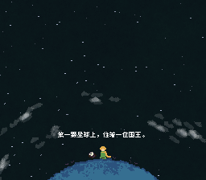 |
| 远处耗子判词「判你死刑。」 | 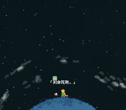 |

### 先闻其声

| 剧情节点 | 截图 |
| --- | --- |
| 地平线后传来「「……来了一个臣民……」」 | 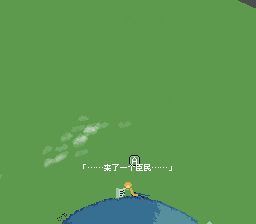 |
| 旁白「所有的人都是臣民。」 | 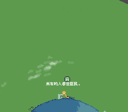 |

### 觐见整章对白

| 剧情节点 | 截图 |
| --- | --- |
| 踏入禁区，国王「走近些，让我看清楚点。」 | 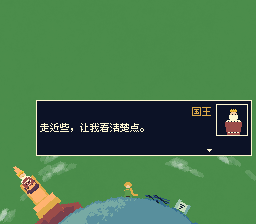 |
| 「我禁止你打哈欠。」 | 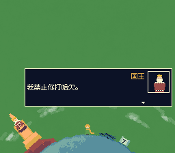 |
| 「统治一切。」 | 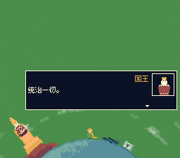 |
| 日落请求 | 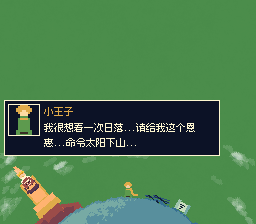 |
| 「大约...今晚七点四十分左右！」 | 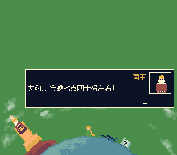 |
| 自由走动，交互提示落在国王身上 | 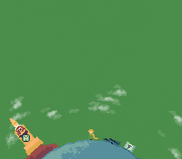 |

### 大臣任命段

| 剧情节点 | 截图 |
| --- | --- |
| 「司法大臣！」 | 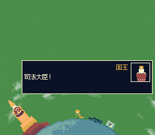 |
| 耗子审判与赦免 | 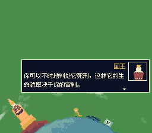 |
| 「我任命你为大使！」 | 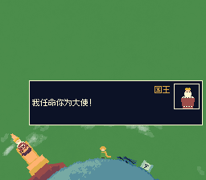 |

### 离星落幕

| 剧情节点 | 截图 |
| --- | --- |
| 鸟群托举，半空感想「大人们真是太奇怪了。」 | 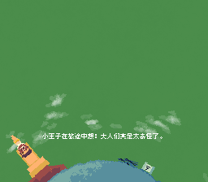 |
| 黑场落幕「325。」 | 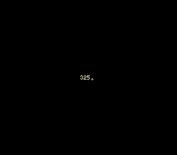 |

## 结论

325 国王星球剧情演出已按原著第十章完整重做，演出结构（开场淡入、头顶旁白、整章对白、二次交互、鸟群离星、黑场字幕）与 B612 定稿模式完全对齐；自动化测试全部通过，15 张关键截图确认演出在真实渲染下完整可玩。
